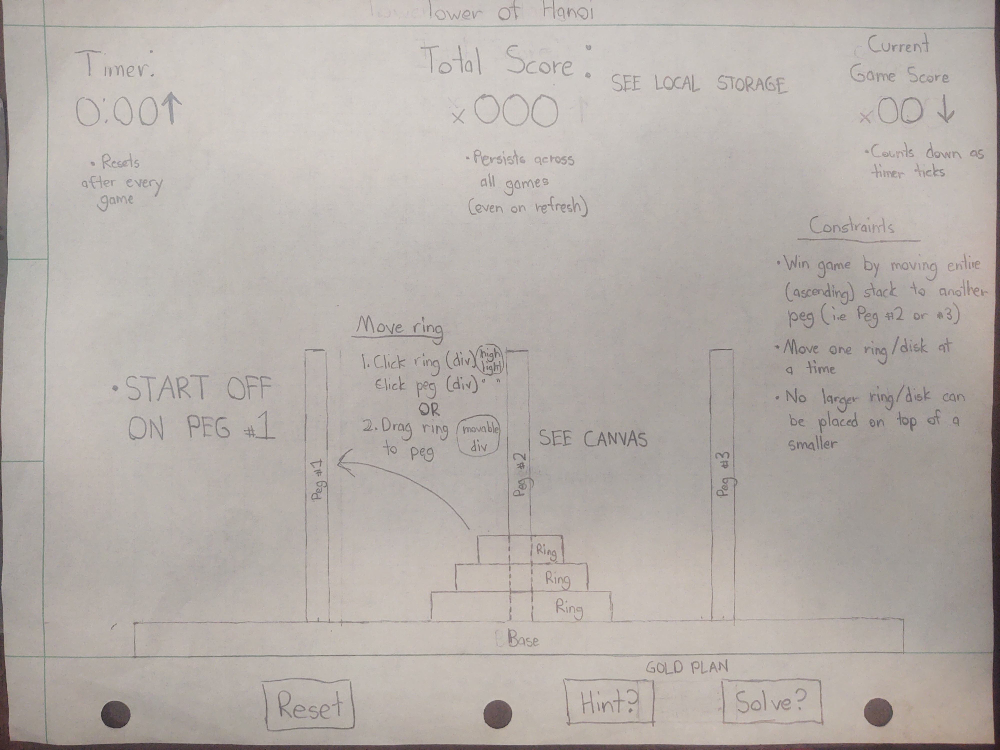
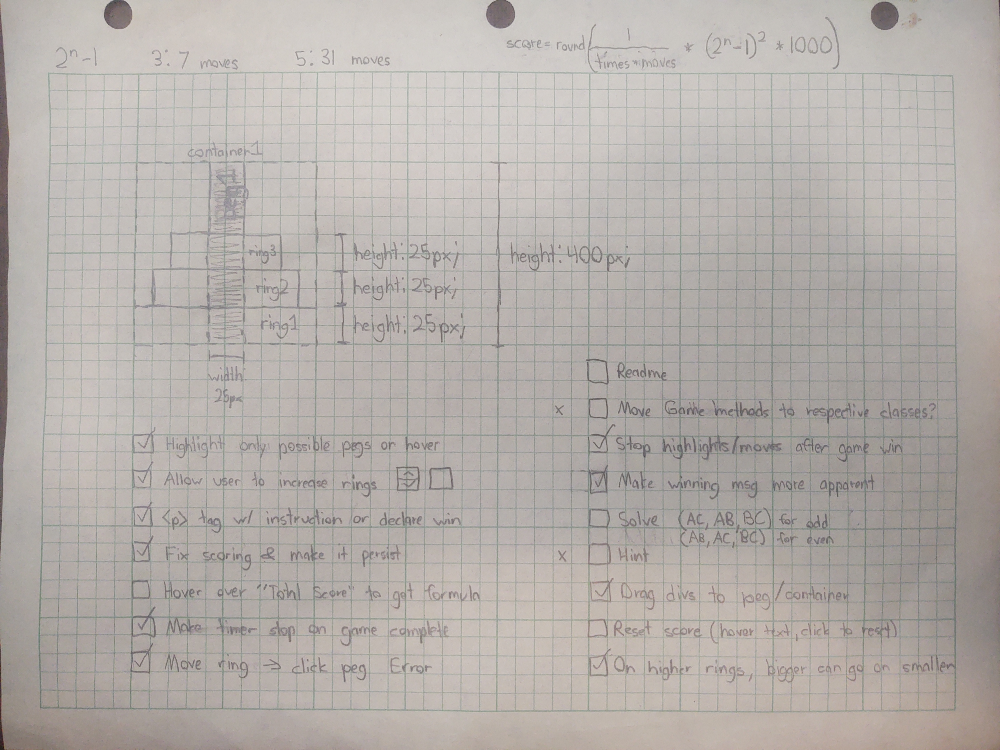

# Project 1: Tower of Hanoi

## Objective
This project involves creating a game that meets the following requirements:

- Render in the browser
- Include separate HTML / CSS / JavaScript files
- Use Javascript for DOM manipulation
- Be deployed online, using Github Project pages and/or to a custom domain.
- Use semantic markup for HTML and CSS (adhere to best practices)
- Show a good commit history with frequent commits

## Description
A game where an ascending stack of rings must be moved from one rod to another where:

1. Only one ring can be moved at a time
2. No larger ring can be placed on a smaller

## Installation: 
- [Go to Game](https://xenodochial-poincare-598164.netlify.app/).


## Main Features
- Features games ranging from 3 rings to 7 rings
- Rings are able to be moved to pegs EITHER by clicking or by dragging 
- Automatic solution of puzzle (from game start)
- Checks in place to avoid illegal moves
- A scoring system based on the number of moves and the solution time

## User Stories
- Be able to start a new game of Tower of Hanoi (automatically)
- Have instructions on how to play the game
- Easily able to move rings from one ring to the next
- Not be able to make illegal moves
- Know how good I am doing (ex. timer, movement score, etc.)
- Know when the game is over, either by an message or functionality shutdown
- Be able to reset game
- Be able to change the number of rings

## Technologies Used
Javascript ES6, HTML5, and CSS3
DOM Manipulation

## The Plan
- Wireframe:


## The Approach
- Based on the wireframe image, the page itself was constructed using a grid layout
- Another grid system for the elements of the peg container (peg, rings) was considered
    - However, easier/less complicated results were achieved using flex-end containering as shown in the image below

- Structure of a Container:


- Javascript was where 95% of the time was spent
    - CSS was known from the beginning to be a "back burner"/platinum plan idea
- Rather than using fixed HTML content, divs were generated using JS for all game elements
    - Template HTML code was used as a model at first for these generations
    - A container was put in each grid cell
    - Each container has respective a peg and ring container
- Because of the way I was containering, I decided to put all objects (i.e. rings, pegs, individual buttons, etc.) into their own separate class
    - The belief was that this would make the code easier to understand and edit
    - This did/does create problems in maintaining local variables

Example of Separate Class: 

```
class Timer {
    constructor() {
        this.updateTimer = setInterval(this.setTime, 1000);
    }

    setTime() {
        seconds++;

        let minutes = Math.floor(seconds / 60);
        let secondsTemp = seconds % 60;
        timer.innerHTML = `${minutes}:${(secondsTemp + "").length < 2 ? `0` : ``}${secondsTemp}`
    }

    stopTime() {
        clearInterval(this.updateTimer);
    }
}
```

- Score formula
    - =(Least possible # of moves * 2 seconds per move) / (User moves * User times)
    - Stored using local storage
- Drag and drop attributes for the rings (using Canvas) were used to serve as an alternative to moving
- The automatic solution was "solved" using an iterative solution
    - For an odd number of rings, legal moves would be made (if possible) between:
        1. Pegs A and C
        2. Pegs A and B
        3. Pegs B and C
        4. Repeat (using recursion)
- For every new issue I ran into or thought of, I added to a list of TO DO items
    - These can be seen in the "Structure of a Container" image above


## Unsolved Problems/Future Improvements
- The styling/CSS structuring of the project could use a bit more creativity
- The formula used to generate the "Total Score" is arbitrary to the user.
    - Maybe some tooltip/modal window to display the formula when hovering over the score
- A spin box for selecting the number of rings to reset to
- Being able to make the "Solve" button work mid-game
    - Right now, the solve feature only works from the start
    - Running from anywhere else most of the time creates an infinite loop
- Hint button for next move
- Refactoring of code so all ring methods are in Ring class, peg methods are in Peg class, etc.


